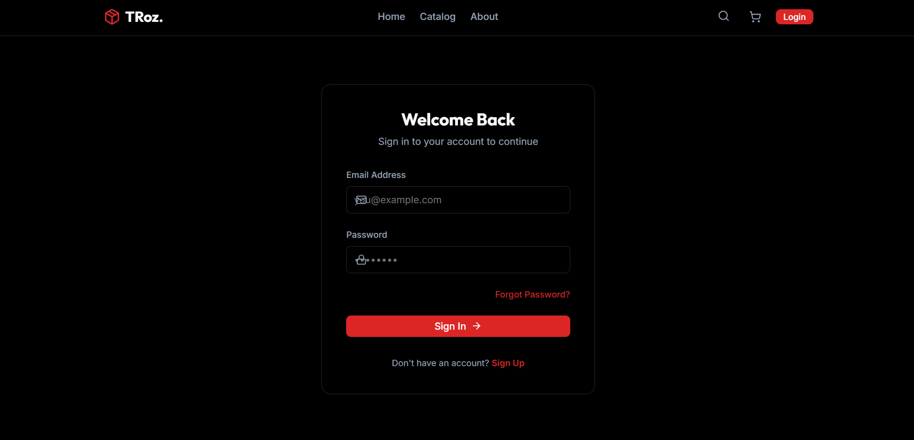

# 🚀 TRoz

A modern web application built using **Vite + React**, focused on performance and clean UI.

---

## 📸 Screenshots

### 🏠 Home Page


### 🔐 Login Page


### 📊 Dashboard


### 📊 Cart


### 📊 Invoice


---

## 🛠 Tech Stack

- ⚛️ React (Vite)
- 🎨 CSS
- 📦 npm
- 🧹 ESLint

---

## ✨ Features

- Fast development with Vite
- Component-based architecture
- Responsive UI
- Clean project structure
- Easy to extend with backend

---

## 📂 Project Structure

```text
TRoz/
├── public/
├── src/
├── screenshots/
├── index.html
├── package.json
└── vite.config.js
